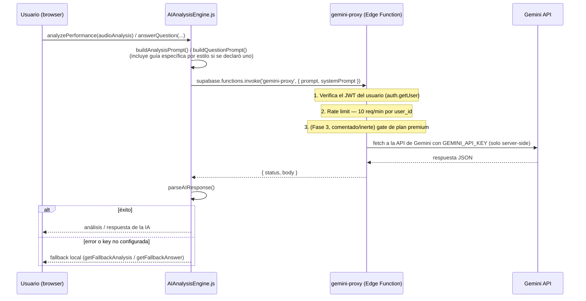

# PianoStudy

Aplicación web para pianistas: grabá sesiones de práctica, analizalas con MIR (Music Information Retrieval) real, recibí feedback generado por IA especializado en jazz afrocubano/latino/colombiano, y armá tu biblioteca personal de licks.

Este README documenta la arquitectura **post-split** del proyecto (Fase 2 del roadmap de seguridad/arquitectura, ver `DIAGNOSTICO_Y_PLAN.md`). Si buscás el historial de decisiones de una sesión de trabajo remota puntual, mirá `RESUMEN_SESION_REMOTA_*.md`.

---

## Índice

1. [Qué hace PianoStudy](#qué-hace-pianostudy)
2. [Stack](#stack)
3. [Estructura de carpetas](#estructura-de-carpetas)
4. [Cómo está organizado el frontend (post-split)](#cómo-está-organizado-el-frontend-post-split)
5. [Correr en local](#correr-en-local)
6. [Variables de entorno](#variables-de-entorno)
7. [Tests](#tests)
8. [Deploy](#deploy)
9. [Flujo de las funciones de IA](#flujo-de-las-funciones-de-ia)
10. [Base de datos (Supabase)](#base-de-datos-supabase)
11. [Seguridad — estado actual](#seguridad--estado-actual)
12. [Roadmap](#roadmap)
13. [Documentos relacionados](#documentos-relacionados)

---

## Qué hace PianoStudy

- **Grabación de sesiones de práctica** con selección de dispositivo de audio, visualización en tiempo real y modo con backing track.
- **Análisis musical real** (no heurísticas caseras): tempo, tonalidad, loudness, complejidad dinámica y timbre vía [Essentia.js](https://mtg.github.io/essentia.js/), más transcripción audio→MIDI vía [basic-pitch](https://basicpitch.spotify.com/) de Spotify.
- **Feedback generado por IA** (Gemini hoy, Anthropic preparado) sobre esas métricas, con prompts especializados en son cubano, bebop, hard bop, latin jazz, bolero y **jazz colombiano** — un estilo con muy poca cobertura pedagógica en otras apps.
- **Biblioteca de licks** categorizada por estilo, con audio adjunto opcional.
- **Editor de frases**: recortar fragmentos de una grabación y guardarlos como licks.
- **Descubrimiento de artistas** por estilo (blues, bebop, hard-bop, latin jazz, son cubano, bolero, jazz colombiano) con discografía y enlaces a YouTube.
- **YouTube Study**: marcar fragmentos de un video de YouTube para practicar en loop.
- **Progreso**: tiempo de práctica, rachas, medallas.
- **Autenticación propia** sobre Supabase Auth, con recuperación de contraseña por pregunta de seguridad (PBKDF2, no texto plano).

Hoy PianoStudy es gratuito. Hay un esqueleto preparado (no activo) para un plan Premium vía Stripe — ver [Roadmap](#roadmap).

## Stack

| Capa | Tecnología |
|---|---|
| Frontend | JavaScript vanilla (ES modules), sin framework de UI |
| Bundler / dev server | [Vite](https://vitejs.dev/) |
| Tests | [Vitest](https://vitest.dev/) |
| Backend | [Supabase](https://supabase.com/) — Postgres + Auth + Storage + Edge Functions (Deno) |
| Análisis de audio | [Essentia.js](https://mtg.github.io/essentia.js/) (WASM, vía CDN) |
| Audio → MIDI | [basic-pitch](https://basicpitch.spotify.com/) de Spotify (vía CDN) |
| IA | Google Gemini (activo) y Anthropic Claude (proxy preparado, sin uso del lado del cliente todavía) |
| CI | GitHub Actions (build + test en cada PR, no despliega) |
| Pagos | Stripe (esqueleto preparado, no configurado — ver sección Roadmap) |

Essentia.js, basic-pitch, el cliente de Supabase y la API de YouTube se cargan como `<script>` de CDN en `index.html`, **no** están en `package.json` ni pasan por el bundler — es una decisión deliberada para no descargar/versionar esas librerías pesadas (WASM incluido) todavía. Ver tarea 2.4 pendiente en `DIAGNOSTICO_Y_PLAN.md` si se quiere cambiar eso.

## Estructura de carpetas

```
.
├── index.html                     # entry point de Vite; también carga los <script> de CDN
├── styles.css                     # todo el CSS del proyecto (un solo archivo)
├── vite.config.js                 # config de Vite + Vitest (bloque `test`)
├── package.json
│
├── assets/js/
│   ├── app/                       # la app principal, dividida por dominio (ver sección siguiente)
│   │   ├── app-init.js            #   arranque, wiring, bootstrap — ENTRY POINT real de la app
│   │   ├── app-state.js           #   estado global (antes era el constructor de app.js)
│   │   ├── app-ui.js              #   DOM/eventos genéricos (setupEventListeners, modales, notificaciones)
│   │   ├── app-controllers.js     #   lógica de features (licks, artistas, favoritos, progreso, YouTube study, timer)
│   │   └── app-audio-flow.js      #   grabación, editor de frases, análisis de IA
│   │
│   ├── modules/                   # clases/servicios de responsabilidad única, reutilizables
│   │   ├── AuthManager.js         #   login/registro/recuperación sobre Supabase Auth
│   │   ├── auth-ui.js             #   UI de auth (modal login/registro), montado aparte en index.html
│   │   ├── ConsentManager.js      #   consentimiento de datos musicales para entrenamiento de IA
│   │   ├── AIAnalysisEngine.js    #   arma los prompts y llama a gemini-proxy
│   │   ├── AudioAnalyzer.js       #   wrapper de Essentia.js + basic-pitch
│   │   ├── ArtistsManager.js      #   sección de artistas recomendados + artistas propios
│   │   ├── FavoriteSongsManager.js#   canciones favoritas
│   │   ├── YouTubeManager.js      #   integración con YouTube iframe API
│   │   ├── ProgressTracker.js     #   cálculo de rachas/medallas
│   │   ├── SupabaseDataManager.js #   TODAS las queries a las tablas de Supabase viven acá
│   │   └── supabase-client.js     #   instancia única del cliente de Supabase (usa import.meta.env)
│   │
│   ├── utils/sanitizers.js        # escapeHtml, sanitizeFileName, validateAudioBlob
│   └── data/artists.js            # catálogo estático de artistas recomendados
│
├── supabase/
│   ├── functions/
│   │   ├── anthropic-proxy/       # proxy a Anthropic — JWT + rate limit, key server-side
│   │   ├── gemini-proxy/          # proxy a Gemini — JWT + rate limit, key server-side (el que usa la app hoy)
│   │   ├── stripe-webhook/        # esqueleto de Fase 3, no conectado (ver sección Roadmap)
│   │   └── _shared/rateLimiter.ts # lógica de rate limiting, compartida y testeada
│   └── migrations/                # schema versionado en git (ver sección Base de datos)
│
├── tests/                         # Vitest — ver sección Tests
├── scripts/
│   ├── backup/                    # scripts de backup de DB y storage (Windows Task Scheduler)
│   └── git/                       # script de mirror del repo a GitLab/Gitea
│
├── legal/                         # borrador de Términos de Servicio y Política de Privacidad
├── .github/workflows/ci.yml       # build + test en cada PR
│
├── DIAGNOSTICO_Y_PLAN.md          # roadmap de seguridad/arquitectura completo, con checklist
├── RUNBOOK_DEPLOY.md              # cómo desplegar (manual, hasta que haya CD real)
├── RUNBOOK_DISASTER_RECOVERY.md   # cómo restaurar código/DB/storage ante un desastre
└── _pendiente_revision/           # archivos reemplazados que no se borraron todavía (ver su README)
```

## Cómo está organizado el frontend (post-split)

Hasta la Fase 2, toda la lógica de la app vivía en un único `app.js` de ~4700 líneas (una sola clase `PianoStudyApp` con 171 métodos). Se dividió en 5 archivos por dominio dentro de `assets/js/app/`, usando el **patrón mixin**: cada archivo exporta un objeto plano con métodos (`stateMixin`, `uiMixin`, `controllersMixin`, `audioFlowMixin`), y `app-init.js` los combina sobre un único `PianoStudyApp.prototype` con `Object.assign`:

```js
class PianoStudyApp {
    constructor() { initState(this); }   // antes era el cuerpo del constructor de app.js
    async init() { /* ... */ }           // arranque/wiring, se queda acá
}

Object.assign(PianoStudyApp.prototype, stateMixin, uiMixin, controllersMixin, audioFlowMixin);
```

**Por qué mixin y no 5 clases separadas:** el objetivo era reorganizar archivos sin rediseñar cómo se comunican entre sí 171 métodos que hoy comparten `this` libremente. Con el patrón mixin, el resultado en runtime es exactamente el mismo objeto único de siempre — cero cambio de comportamiento, es una migración de archivos, no un rediseño. El split se verificó reconstruyendo los 171 métodos en su orden original a partir de los 5 archivos y comparando el resultado byte a byte contra el `app.js` original (ver `_pendiente_revision/README.md`).

El `app.js` original que existía antes del split está en `_pendiente_revision/app.js`, no se borró — ver ese README para el criterio de cuándo es seguro borrarlo.

`assets/js/modules/auth-ui.js` es un módulo aparte, montado directamente en `index.html` junto a `app-init.js`, no forma parte de la clase `PianoStudyApp`.

## Correr en local

Requiere Node 18+ (probado con Node 24) y npm.

```bash
npm install
npm run dev
```

Abre en `http://localhost:5173`. Usa el mismo proyecto Supabase que producción (ver [Variables de entorno](#variables-de-entorno)) — no hay un proyecto Supabase separado para desarrollo todavía.

**Nota sobre HMR y CSP:** `index.html` tiene una Content Security Policy estricta vía `<meta>`. No incluye `ws://localhost` en `connect-src`, así que el WebSocket de hot-reload de Vite puede fallar en consola durante `npm run dev` — el resto de la app debería funcionar igual, solo sin auto-reload. Para probar el build real de producción localmente (recomendado antes de dar algo por probado):

```bash
npm run build
npm run preview   # sirve dist/ en http://localhost:4173, sin este problema de CSP/HMR
```

## Variables de entorno

Vite expone al cliente cualquier variable que empiece con `VITE_`, definida en `.env.development` (para `npm run dev`) o `.env.production` (para `npm run build`). Hoy ambos archivos tienen los mismos valores porque no existe un proyecto Supabase separado para desarrollo:

| Variable | Dónde se usa | ¿Es secreta? |
|---|---|---|
| `VITE_SUPABASE_URL` | `assets/js/modules/supabase-client.js` | No — diseñada para viajar al cliente |
| `VITE_SUPABASE_ANON_KEY` | `assets/js/modules/supabase-client.js` | No — el acceso real lo controla RLS en el servidor |

Ninguna de las dos es secreta, por eso ambos `.env.*` están commiteados (no en `.gitignore`).

**Secrets del lado del servidor** (Supabase Dashboard → Project Settings → Edge Functions → Secrets — **no van en ningún archivo de este repo**):

| Secret | Usado por | Estado |
|---|---|---|
| `ANTHROPIC_API_KEY` | `supabase/functions/anthropic-proxy` | Pendiente de cargar (paso 0.1 del roadmap) |
| `GEMINI_API_KEY` | `supabase/functions/gemini-proxy` | Pendiente de cargar (paso 0.1 del roadmap) |
| `SUPABASE_URL` / `SUPABASE_ANON_KEY` / `SUPABASE_SERVICE_ROLE_KEY` | Los 3 edge functions | Inyectadas automáticamente por Supabase, no hace falta cargarlas a mano |
| `STRIPE_SECRET_KEY` / `STRIPE_WEBHOOK_SECRET` | `supabase/functions/stripe-webhook` | No configurado — Fase 3, ver Roadmap |

Sin `ANTHROPIC_API_KEY`/`GEMINI_API_KEY` cargadas, los proxies responden `500` — la app sigue funcionando para todo lo demás, pero el análisis de IA cae al fallback local (`getFallbackAnalysis`/`getFallbackAnswer` en `AIAnalysisEngine.js`).

Para los scripts de backup (`scripts/backup/`) hay variables de entorno adicionales a nivel de sistema operativo (`SUPABASE_DB_URL`, `SUPABASE_SERVICE_ROLE_KEY`) — ver `scripts/backup/README.md`, son independientes de las de Vite.

## Tests

```bash
npm test
```

13 tests con Vitest en `tests/`:

- `sanitizers.test.js` — `escapeHtml`, `sanitizeFileName`, `validateAudioBlob`.
- `rateLimiter.test.js` — la lógica de `supabase/functions/_shared/rateLimiter.ts` (límite por usuario, ventana de tiempo), usada por los tres edge functions.
- `authManager.test.js` — `hashPassword` (PBKDF2, 100k iteraciones) y `generateSalt`.

`tests/setup.js` stubea el global `supabase` (que en el browser real lo inyecta el script de CDN) para poder importar módulos que dependen de `supabase-client.js` bajo Node.

El workflow de GitHub Actions (`.github/workflows/ci.yml`) corre estos tests y el build en cada PR contra `main`.

## Deploy

Manual por ahora — ver `RUNBOOK_DEPLOY.md` para los pasos completos (Netlify, Vercel, GitHub Pages, y el deploy separado de las Edge Functions). Resumen:

```bash
npm run build     # genera dist/ con cache-busting automático (nombres con hash)
```

`dist/` se puede servir desde cualquier hosting estático. Las Edge Functions (`anthropic-proxy`, `gemini-proxy`, `stripe-webhook`) se despliegan aparte con `supabase functions deploy <nombre>` — el build del frontend no las toca.

## Flujo de las funciones de IA



`anthropic-proxy` sigue el mismo patrón (JWT + rate limit + key server-side) pero **no lo llama nada del cliente todavía** — está preparado para cuando se necesite (por ejemplo, un "director" de IA en NeuralJam, ver roadmap del proyecto hermano `AI-Duet-Local`). La API key nunca vive en el cliente en ninguno de los dos casos — eso fue la Fase 0 del roadmap de seguridad.

## Base de datos (Supabase)

El schema vive versionado en `supabase/migrations/*.sql`, numerado y aplicado en orden. **Importante:** esos archivos son una reconstrucción hecha a partir de lo que ya estaba documentado + el uso real del código, no un `db pull` verificado contra el proyecto real — leer `supabase/migrations/README.md` antes de asumir que reflejan el schema real al 100%.

Tablas principales: `licks`, `recordings`, `custom_artists`, `favorite_songs`, `user_profiles`, `practice_sessions`. Todas con Row Level Security — cada usuario solo puede leer/escribir sus propias filas (`auth.uid() = user_id`, con la excepción de `stripe-webhook`, que usa la service role key para poder actualizar el perfil de cualquier usuario).

Columnas de `user_profiles` relevantes para IA y pagos (agregadas en Fase 3, ver Roadmap):

- `plan` (`free` por defecto | `premium`) y `paid_until` — controla el esqueleto de Stripe.
- `ai_data_consent` (boolean, default `false`) y `ai_data_consent_at` — si el usuario dio consentimiento explícito para que sus datos musicales se usen en entrenamiento de IA (ver `legal/politica-de-privacidad.md` sección 4). Lo gestiona `ConsentManager.js`, con un modal que se muestra una sola vez, la primera vez que el usuario tiene sesión iniciada y ese consentimiento sigue sin responder.

## Seguridad — estado actual

Resumen; el detalle completo con checklist está en `DIAGNOSTICO_Y_PLAN.md`.

- ✅ API keys de IA fuera del cliente, proxies con JWT + rate limiting (Fase 0).
- ✅ PBKDF2 (100k iteraciones) para la respuesta de seguridad de recuperación de cuenta.
- ✅ `.innerHTML` auditado — todo el contenido dinámico pasa por `escapeHtml`.
- ⚠️ El bucket `recordings` de Storage tiene lectura pública por URL directa — es una decisión de producto pendiente de confirmar, no un descuido (ver tarea 0.10/2.4 en `DIAGNOSTICO_Y_PLAN.md`).
- ⚠️ Falta cargar `ANTHROPIC_API_KEY`/`GEMINI_API_KEY` como secrets de Supabase para que la IA funcione en producción con el código actual (paso 0.1, pendiente del lado del usuario, no del código).

## Roadmap

Fases 0, 1 y 2 completas (seguridad, backup/DR, arquitectura). Fase 3 (pagos) tiene un **esqueleto preparado pero inerte**:

- `supabase/migrations/0004_plan_columns.sql` — columnas `plan`/`paid_until`, seguras de aplicar ya (default `free` para todos, no cambia nada).
- `supabase/functions/stripe-webhook/` — estructura completa (verificación de firma, manejo de `checkout.session.completed`, `customer.subscription.deleted`, `invoice.payment_failed`), pero no funciona hasta cargar `STRIPE_SECRET_KEY`/`STRIPE_WEBHOOK_SECRET` y construir el flujo de Checkout Session (no incluido todavía).
- Gate de plan premium en `anthropic-proxy`/`gemini-proxy` — escrito pero **comentado a propósito**: activarlo hoy bloquearía a todos los usuarios, porque nadie tiene `plan = 'premium'` todavía.
- `legal/terminos-de-servicio.md` / `legal/politica-de-privacidad.md` — borrador con las secciones de pagos ya redactadas pero comentadas, listas para descomentar cuando Stripe esté configurado.

Ver `DIAGNOSTICO_Y_PLAN.md` para el roadmap completo, incluyendo la integración futura de NeuralJam Mirror como sección premium.

## Documentos relacionados

- `DIAGNOSTICO_Y_PLAN.md` — diagnóstico completo y roadmap por fases, con checklist.
- `RUNBOOK_DEPLOY.md` — deploy paso a paso.
- `RUNBOOK_DISASTER_RECOVERY.md` — cómo restaurar código/DB/storage ante un desastre.
- `supabase/migrations/README.md` — de dónde sale el schema versionado y qué falta verificar.
- `scripts/backup/README.md` — setup de los backups automáticos.
- `legal/` — borrador de Términos de Servicio y Política de Privacidad (sin revisión legal todavía).
- `RESUMEN_SESION_REMOTA_*.md` — bitácora de sesiones de trabajo remoto puntuales.

## Licencia

El README anterior declaraba licencia MIT, pero no hay ningún archivo `LICENSE` en el repo — no se agregó uno en esta sesión porque la elección de licencia (o directamente no publicar el código bajo ninguna licencia abierta) es una decisión de producto, no algo para asumir. Si vas a declarar una licencia, agregá el archivo `LICENSE` correspondiente y actualizá esta sección.
